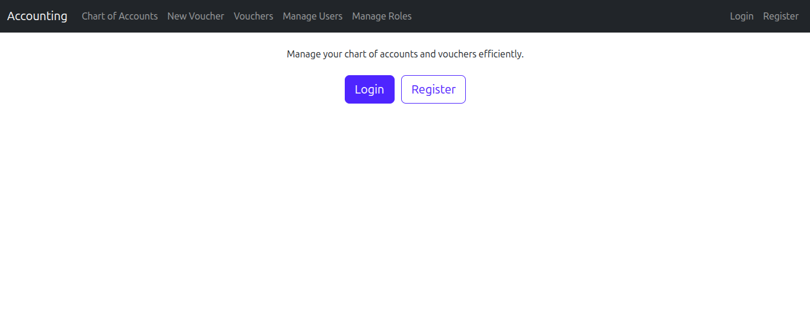
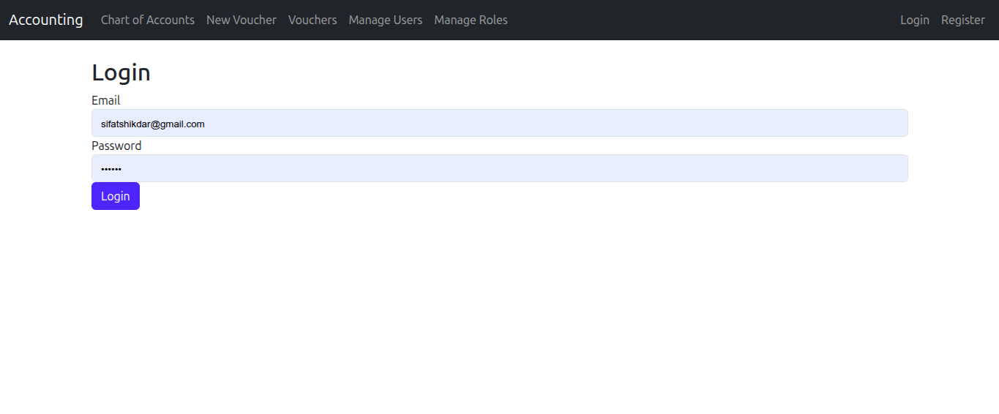
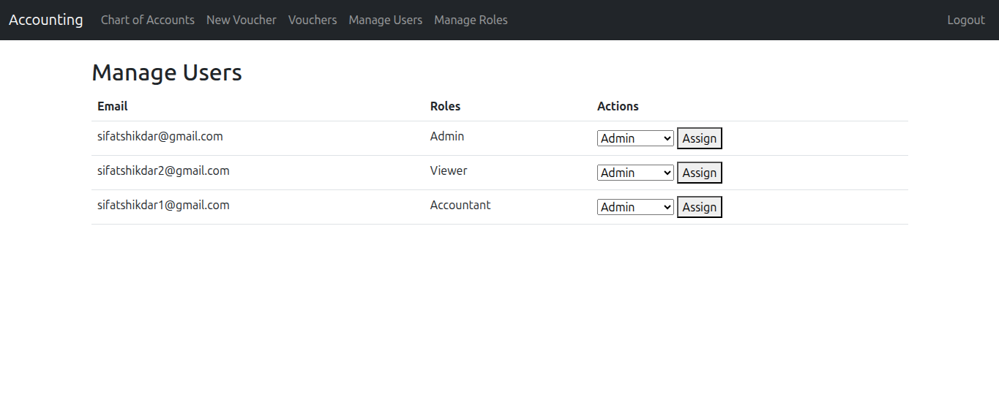
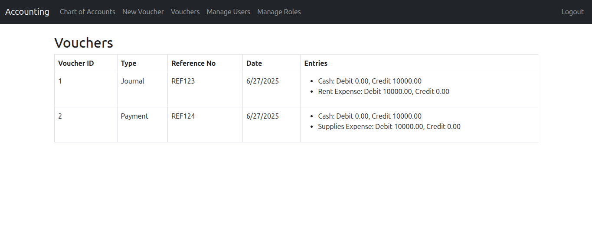
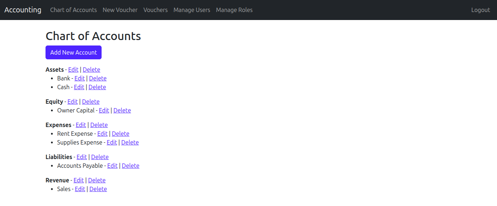
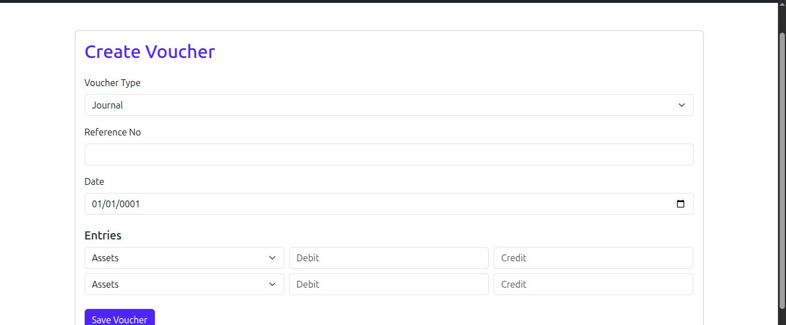

# AccountManagement

A C# project for managing user accounts, authentication, and authorization.

## Features

- User registration and login
- Role-based access control
- Add account and transactions

## Screenshots

Here are some screenshots of the AccountManagement application:








1. **Clone the repository:**
    ```bash
    git clone https://github.com/yourusername/AccountManagement.git
    ```

2. **Navigate to the project directory:**
    ```bash
    cd AccountManagement
    ```

3. **Build the project:**
    ```bash
    dotnet build
    ```

4. **Run the project:**
    ```bash
    dotnet run
    ```

## Requirements

- [.NET 6.0 SDK](https://dotnet.microsoft.com/download)
- SQL Server or compatible database

## Configuration

Update the `appsettings.json` file with your database connection string and other settings.

## Contributing

Contributions are welcome! Please open issues or submit pull requests.

## License

This project is licensed under the MIT License.
